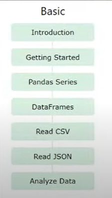
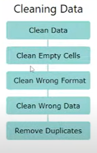
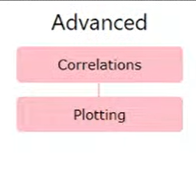

# 12-01-2023 | DAY 14 | Pandas Library Part - 1

# Pandas
- By McKinney - 2008
- working with dataset
- analyzing
- cleaning
- exploring
- manipulating
- refernce = "panel data" , "python"
- analyze big data
- relevent data is very important 

    ## ADVANTAGE
    - fast and efficent manipulating and analyzing data
    - diff file object can be read
    - easy handlling of missing data
    - size mutablity
    - dataset marging and joinning
    - time series functionality

    
    
    

