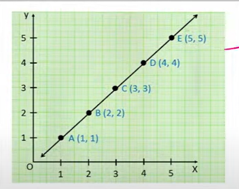
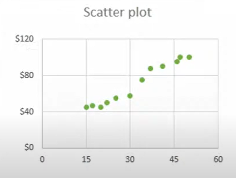
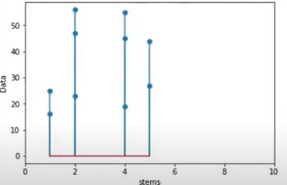
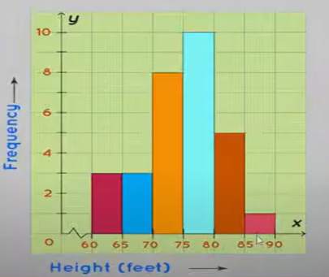
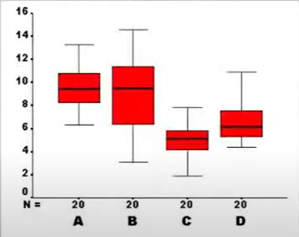
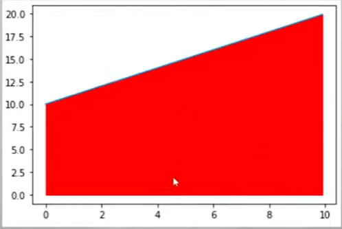

# 12-01-2023 | DAY 16 | Matplotlib Library Part - 1

# Matplotlib 
- data visualization
- build on numpy lib
- work with borader scipy
- modlue - pyplot

    import matplotlib.pyplot as plt

    pip install matplotlib

    # GRAPHS
    1. Linera
    
    2. Scatter
    
    3. Bar
    4. Stem
    
    5. Step
    
    6. Hist
    
    7. Box
    
    8. Pie
    9. Fill_Between
    

