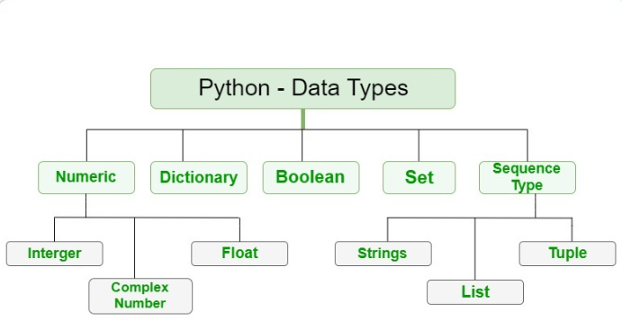

 # 10-01-2023    DAY 2  Variables & Operators in python 

 # Variables
 - container that store values
 - dont need to declare it in python
 - basic unit of storage in program

    ## variables Name
    - can have short name
    - must start with _(underscore)
    - cannot start with number
    - can only contain alpha-numeric
    - case-sensitive
    - cannot be any python keywords

    ## creating variable
    - no command for decalaration
    - created the moment you first assing a value

    EX: 
    X,Y,Z, = "Orange","Banana","Cherry"

# DATA TYPE
- var store data of diff types
- diff types cand do diff
- following is python data type
    1. str = text type
    2. int,float,complex = Numeric 
    3. list,tuple,rang = Sequence
    4. dict = mapping
    5. set,frozenset = set type
    6. bool = boolean
    7. bytes,bytarray,memoryview = binary

    

 # Operators
 - 