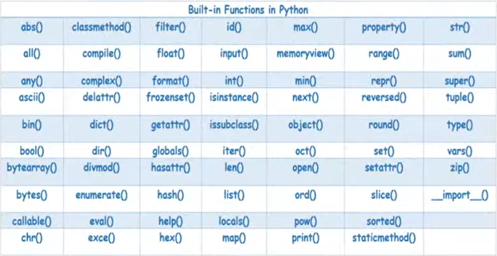

# 10-01-2023 | DAY 3 | InBuilt functions of python

# Need of Function
- Reusablity
- complex operation put gether as singuler task

# Types of function in python
    1. Built-in Function
    2. Recursive Function
    3. Lambda Function
    4. User-defined Function

# 1. BuiltIN Function
- 68 builtIN Function
- Allredy predefine
