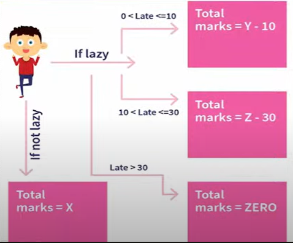
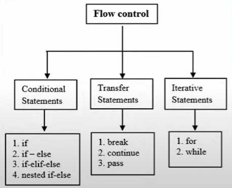

# 10-01-2023 | DAY 4  | Control flow statement

# Control flow statements
- flow + control
- many statements consisting of multiplr operation
- Making descisions according to situation

# if statement
- descision making
- certain statment or block of statment will be excecuted or not

# if else
- conditional descision making

